Hi! I'm Gwenn Le Bihan, interested in almost anything that is both creative and digital.

Started programming with python (which I still love and use extensively) and web programming, now diversifying and learning about lower-level languages (Go, and now learning Rust).

I really like creating:

- experimental A/V stuff (see [shapemaker](https://github.com/gwennlbh/shapemaker))
- web applications, whether 
  - huge (see [Churros](https://git.inpt.fr/inp-net/churros) or [schoolsyst](https://github.com/schoolsyst))
  - or small (see [ultisnips-tools](https://github.com/gwenn°-lbh/ultisnips-tools))
- automation of mundane tasks with CLIs (see [ffcss](https://github.com/gwennlbh/ffcss), [fsorg](https://github.com/gwennlbh/fsorg))
- dev tooling (see [ortfo](https://github.com/ortfo), [automirror](https://github.com/inp-net/automirror), [issurge](https://github.com/gwennlbh/issurge), [hyprls](https://github.com/hyprland-community/hyprls), [caddy-i18n](https://github.com/gwennlbh/caddy-i18n))
<!--
- CLIs with pretty interfaces (see [ideaseed](https://github.com/gwenn°-lbh/ideaseed))
- small and [do-one-thing-and-do-it-well](https://en.wikipedia.org/wiki/Unix_philosophy#origin) packages (see [python-strip-ansi](https://github.com/gwenn°-lbh/python-strip-ansi))
-->

I work on a lot of projects and also do [music](https://gwen.works/to/spotify) and [graphism/motion design](https://gwen.works) on top of that, and some small papers/books (not published yet because it's the rough beginnings!)

<!-- I like minimalism, so my website's domain name is just [gwen.works](https://gwen.works) accessing the `works` array on the `gwen` object ;) -->

<!-- I started publishing some art stuff [on RedBubble](https://www.redbubble.com/people/gwenn°lbh/shop) as well. -

After 2 intense years of maths in higher education to earn access to highly selective engineering schools called "Grandes Écoles", I got into [ENSEEIHT](https://enseeiht.fr/), one of France's best computer science schools!

I am now (for the school year 2023-2024) the president of my engineering school's computer science association, [net7](https://net7.dev). I contribute a lot to the enhancement of the school's student life with various projects, available on [net7's Gitlab](https://git.inpt.fr/users/lebihae/contributed) -->

  
Languages over all time

  
  

