Hi! I'm Ewen Le Bihan, interested in almost anything that is both creative and digital.

Started programming with python (which I still love and use extensively) and web programming, now diversifying and learning about lower-level languages (Go, and now learning Rust when I have the time).

I really like creating:

- web applications, whether 
  - huge (see [Churros](https://git.inpt.fr/inp-net/churros) or [schoolsyst](https://github.com/schoolsyst))
  - or small (see [ultisnips-tools](https://github.com/ewen-lbh/ultisnips-tools))
- CLIs with pretty interfaces (see [ideaseed](https://github.com/ewen-lbh/ideaseed))
- small and [do-one-thing-and-do-it-well](https://en.wikipedia.org/wiki/Unix_philosophy#origin) packages (see [python-strip-ansi](https://github.com/ewen-lbh/python-strip-ansi))

I work on a lot of projects and also do [music](https://open.spotify.com/artist/6tUc6r8aNeiiT1mElcnMx9?si=ezLedPQ4Qimkep9xmsjpQA) and [graphism/motion design](https://ewen.works) on top of that, and some small papers/books (not published yet because it's the rough beginnings!)

I like minimalism, so my website's domain name is just [ewen.works](https://ewen.works) accessing the `works` array on the `ewen` object ;)

I started publishing some art stuff [on RedBubble](https://www.redbubble.com/people/ewenlbh/shop) as well.

After 2 intense years of maths in higher education to earn access to highly selective engineering schools called "Grandes Écoles", I got into [ENSEEIHT](https://enseeiht.fr/), one of France's best computer science schools!

I am now (for the school year 2023-2024) the president of my engineering school's computer science association, [net7](https://net7.dev). I contribute a lot to the enhancement of the school's student life with various projects, available on [net7's Gitlab](https://git.inpt.fr/users/lebihae/contributed)

<figure><embed src="https://wakatime.com/share/@ewen_lbh/017b384c-8806-4666-8d13-fb4028e219fc.svg"></embed></figure>
